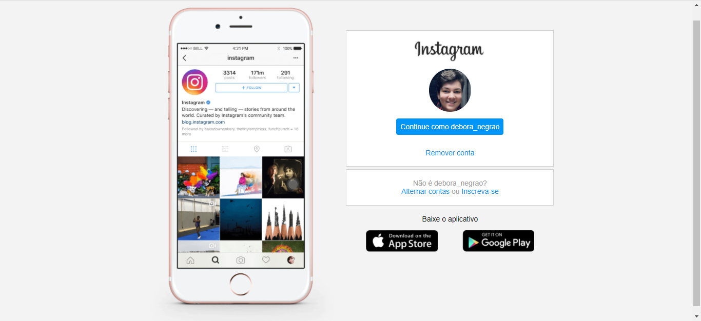

# instagram-landing-page

> This is a project that I developed during the Digital Innovation One Bootcamp. It is a replica of Instragram's landing page, developed in HTML5 and CSS3. The objective is to present the use of design resources and media queries to a responsive design.

## CSS resources

In this project you will check the usability of the following resources:
- padding, margin, background, color, size
- width, height
- display, justify-content, align-items, flex-direction
- media queries

## Meta

Débora Negrão - (https://www.linkedin.com/in/deboranegrao/) - deboraafnegrao@gmail.com
You can check the project in: [instagram-landing-page](https://instagram-landing-page.deboranegrao.repl.co/ "repl.it project")